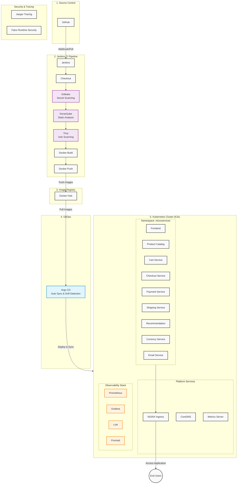

# End-to-End DevSecOps & GitOps Architecture

```mermaid
graph TD
    %% Styling
    classDef default fill:#f9f9f9,stroke:#333,stroke-width:2px;
    classDef gitops fill:#e1f5fe,stroke:#0288d1;
    classDef security fill:#f3e5f5,stroke:#8e24aa;
    classDef k8s fill:#e8f5e9,stroke:#388e3c;
    classDef observability fill:#fff3e0,stroke:#f57c00;

    %% 1. Source Control
    subgraph Source_Control ["1. Source Control"]
        GH[GitHub]
    end

    %% 2. Jenkins CI Pipeline
    subgraph CI_Pipeline ["2. Jenkins CI Pipeline"]
        direction LR
        Jenkins[Jenkins] --> Checkout[Checkout]
        Checkout --> Gitleaks[Gitleaks<br>Secret Scanning]:::security
        Gitleaks --> SonarQube[SonarQube<br>Static Analysis]:::security
        SonarQube --> Trivy[Trivy<br>Vuln Scanning]:::security
        Trivy --> Build[Docker Build]
        Build --> Push[Docker Push]
    end

    %% 3. Image Registry
    subgraph Image_Registry ["3. Image Registry"]
        DockerHub[Docker Hub]
    end

    %% 4. GitOps
    subgraph GitOps ["4. GitOps"]
        ArgoCD[Argo CD<br>Auto Sync & Drift Detection]:::gitops
    end

    %% 5. Kubernetes Cluster (K3s)
    subgraph K3s_Cluster ["5. Kubernetes Cluster (K3s)"]
        direction TB
        
        subgraph Microservices ["Namespace: microservices"]
            Frontend[Frontend]
            Catalog[Product Catalog]
            Cart[Cart Service]
            CheckoutSvc[Checkout Service]
            Payment[Payment Service]
            Shipping[Shipping Service]
            Recommendation[Recommendation]
            Currency[Currency Service]
            Email[Email Service]
        end

        subgraph Platform ["Platform Services"]
            Ingress[NGINX Ingress]
            CoreDNS[CoreDNS]
            Metrics[Metrics Server]
        end

        subgraph Observability ["Observability Stack"]
            Prom[Prometheus]:::observability
            Grafana[Grafana]:::observability
            Loki[Loki]:::observability
            Promtail[Promtail]:::observability
        end
    end
    
    %% End Users & External
    Users((End Users))

    %% Core Flow Connections
    GH -->|Webhook/Poll| Jenkins
    Push -->|Push Images| DockerHub
    DockerHub -->|Pull Images| ArgoCD
    ArgoCD -->|Deploy & Sync| K3s_Cluster
    
    %% Internal K8s Connections
    Microservices --> Ingress
    Ingress -->|Access Application| Users

    %% Security & Additional Context Nodes
    subgraph Additional_Tools ["Security & Tracing"]
        Jaeger[Jaeger Tracing]
        Falco[Falco Runtime Security]
    end
```