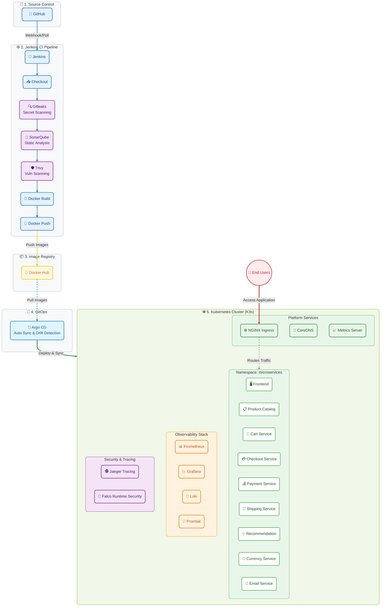

# End-to-End DevSecOps & GitOps Microservices Project

## Overview

This project demonstrates a complete DevSecOps and GitOps pipeline for deploying a cloud-native microservices application on Kubernetes.

The project includes:

* Jenkins CI/CD Pipeline
* Docker Containerization
* Docker Hub Registry
* SonarQube Code Quality Analysis
* Gitleaks Secret Scanning
* Trivy Vulnerability Scanning
* K3s Kubernetes Cluster
* Argo CD GitOps Deployment
* Prometheus Monitoring
* Grafana Visualization

The application deployed is the Google Online Boutique Microservices Demo.

---

## Architecture

GitHub → Jenkins → Docker Build → Docker Hub → Argo CD → K3s Kubernetes → Prometheus → Grafana

---

## Tools Used

| Category         | Tools            |
| ---------------- | ---------------- |
| Source Control   | Git, GitHub      |
| CI/CD            | Jenkins          |
| Security         | Gitleaks, Trivy  |
| Code Quality     | SonarQube        |
| Containerization | Docker           |
| Registry         | Docker Hub       |
| Orchestration    | Kubernetes (K3s) |
| GitOps           | Argo CD          |
| Monitoring       | Prometheus       |
| Visualization    | Grafana          |

---

## Microservices

* Frontend
* Ad Service
* Cart Service
* Checkout Service
* Currency Service
* Email Service
* Payment Service
* Product Catalog Service
* Recommendation Service
* Shipping Service
* Redis Cart

---

## CI/CD Pipeline Stages

### 1. Source Code Checkout

Jenkins pulls source code from GitHub.

### 2. Secret Detection

Gitleaks scans repository for exposed credentials and secrets.

### 3. Static Code Analysis

SonarQube performs code quality and security analysis.

### 4. Vulnerability Scanning

Trivy scans source code and container images.

### 5. Docker Build

Container images are built for all microservices.

### 6. Docker Push

Images are pushed to Docker Hub.

### 7. Kubernetes Deployment

Application is deployed to K3s Kubernetes Cluster.

### 8. GitOps Synchronization

Argo CD continuously syncs Kubernetes manifests from GitHub.

---

## Kubernetes Namespace

```bash
kubectl create namespace microservices
```

Deployment:

```bash
kubectl apply -n microservices -k kubernetes-manifests
```

---

## Monitoring

### Prometheus

Collects:

* CPU Usage
* Memory Usage
* Pod Health
* Kubernetes Metrics

### Grafana

Visualizes:

* Cluster Health
* Namespace Metrics
* Application Performance

---

## Argo CD

Application deployment is managed using GitOps.

Features:

* Automatic Sync
* Self Healing
* Drift Detection
* Rollback Support

---

## Learning Outcomes

* CI/CD Pipeline Design
* Kubernetes Administration
* Docker Image Management
* GitOps Workflows
* Security Scanning
* Monitoring and Observability
* Troubleshooting Production Deployments

---

## Author

Majidulla SK

GitHub: https://github.com/Majidullask04

┌─────────────────────────────────────────────────────────────────────────┐
│                              GitHub                                     │
│                    (Source Code + Manifests)                            │
└───────────────────────────────┬─────────────────────────────────────────┘
                                │ Webhook
                                ▼
┌─────────────────────────────────────────────────────────────────────────┐
│                           Jenkins CI Server                             │
│  ┌─────────────┐  ┌─────────────┐  ┌─────────────┐  ┌─────────────────┐  │
│  │   Git       │  │  Gitleaks   │  │  SonarQube  │  │   Trivy FS      │  │
│  │  Checkout   │  │   Scan      │  │   Analysis  │  │     Scan        │  │
│  └──────┬──────┘  └─────────────┘  └─────────────┘  └─────────────────┘  │
│         │                                                                 │
│         ▼                                                                 │
│  ┌─────────────────────────────────────────────────────────────────┐     │
│  │              Docker Build & Push (per service)                   │     │
│  │         majid04/<service>:micro-service → Docker Hub             │     │
│  └─────────────────────────────────────────────────────────────────┘     │
└─────────────────────────────────────────────────────────────────────────┘
                                │
                                ▼
┌─────────────────────────────────────────────────────────────────────────┐
│                           ArgoCD (GitOps)                               │
│              Continuously syncs K8s manifests from Git                  │
└───────────────────────────────┬─────────────────────────────────────────┘
                                │
                                ▼
┌─────────────────────────────────────────────────────────────────────────┐
│                        K3s Kubernetes Cluster                           │
│  ┌─────────────────────────────────────────────────────────────────┐   │
│  │                     Namespace: microservices                     │   │
│  │  ┌──────────┐ ┌──────────┐ ┌──────────┐ ┌──────────┐           │   │
│  │  │ Frontend │ │  Cart    │ │ Checkout │ │ Payment  │  ...      │   │
│  │  │  Service │ │ Service  │ │ Service  │ │ Service  │           │   │
│  │  └──────────┘ └──────────┘ └──────────┘ └──────────┘           │   │
│  └─────────────────────────────────────────────────────────────────┘   │
│  ┌─────────────────────────────────────────────────────────────────┐   │
│  │                     Observability Stack                          │   │
│  │  ┌──────────┐    ┌──────────┐    ┌──────────┐    ┌──────────┐  │   │
│  │  │Prometheus│───→│ Grafana  │    │  Loki    │←───│ Promtail │  │   │
│  │  │ (Metrics)│    │(Dashboard)│   │  (Logs)  │    │(Collect) │  │   │
│  │  └──────────┘    └──────────┘    └──────────┘    └──────────┘  │   │
│  └─────────────────────────────────────────────────────────────────┘   │
└─────────────────────────────────────────────────────────────────────────┘

Git Push
    │
    ├──→ Stage 1: Git Checkout
    │         Pull latest from Majidullask04-patch-1 branch
    │
    ├──→ Stage 2: Gitleaks Scan
    │         Detect hardcoded secrets, API keys, tokens
    │
    ├──→ Stage 3: SonarQube Analysis
    │         Static analysis for bugs, vulnerabilities, code smells
    │
    ├──→ Stage 4: Quality Gate
    │         Wait for SonarQube pass/fail verdict
    │
    ├──→ Stage 5: Trivy Filesystem Scan
    │         Scan dependencies and configs for CVEs
    │
    ├──→ Stage 6: Docker Build & Push
    │         Build per-service images → majid04/<service>:micro-service
    │
    └──→ Stage 7: Deploy to K3s
              kubectl apply -k kubernetes-manifests -n microservices

# End-to-End DevSecOps & GitOps Architecture

